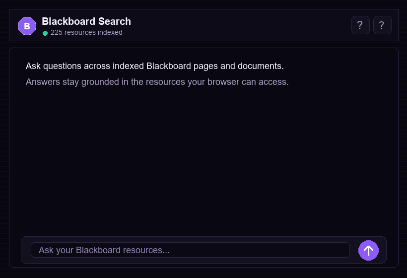

# Blackboard Search Extension

Blackboard Search Extension is a local Chrome extension that lets students search the Blackboard resources their own logged-in browser can already access. It indexes Blackboard pages and downloadable course files, then uses a user-provided API key to answer questions from the matched sources.

The launch version on `main` is intentionally focused on text and document search. Video transcript detection and transcription work lives on the `video-functionality` branch until it is reliable enough to merge.

## Demo



The extension-only demo shows the core flow: ask a question, get an answer grounded in indexed Blackboard resources, expand the source list, and open the underlying source.

## What It Does

- Crawls the Blackboard areas available to the signed-in user.
- Indexes Blackboard pages, announcements, links, PDFs, and common Office documents when readable in Chrome.
- Stores the searchable index locally in Chrome storage.
- Lets the user choose OpenAI, DeepSeek, or OpenRouter and save their own API key locally.
- Retrieves relevant snippets first, then sends only the question and matched snippets to the selected API provider.
- Shows expandable sources so users can inspect where an answer came from.
- Supports `/index` to refresh the local Blackboard index from chat.
- Supports `/feedback` to open a configured two-question feedback form.

## What It Does Not Do

- It does not bypass Blackboard permissions or login requirements.
- It does not upload the full Blackboard corpus to a shared server.
- It does not include production video transcription on `main`; that work is isolated in `video-functionality`.
- It is not affiliated with Blackboard, Tsinghua University, or Schwarzman Scholars.

## Install Locally

1. Download or clone this repo.
2. Open `chrome://extensions` in Chrome.
3. Enable **Developer mode**.
4. Click **Load unpacked**.
5. Select the repo folder, for example `C:\repos\BlackboardSearchExtension`.
6. Open Blackboard and log in normally.
7. Open the extension side panel.
8. Send `/index` after logging into Blackboard to build the local resource index.
9. Add your API provider, model, and API key in **Setup**.
10. Ask questions from your indexed Blackboard resources.

If you pull updates from GitHub, reload the extension on `chrome://extensions` before using it again.

## Chat Commands

```text
/index
```

Builds or refreshes the local Blackboard index. Use this after first install, after Blackboard content changes, or when a source seems missing.

```text
/feedback [optional note]
```

Opens the configured feedback form. If the user includes a note after `/feedback`, the extension pre-fills the first form question with that note. If no form URL is configured, the extension explains that feedback collection is not live yet.

## Feedback Form Setup

Create a lightweight form in Google Forms, Tally, Airtable Forms, or a similar service.

Recommended title:

```text
Blackboard Search Feedback
```

Recommended visible questions:

```text
Suggestions for the bot
```

```text
Any other issues you're experiencing that software could help with?
```

Then set these constants near the top of `sidepanel/sidepanel.js` before packaging the extension:

```js
const FEEDBACK_FORM_URL = "https://your-form-url";
const FEEDBACK_FORM_FIELD_MAP = {
  suggestions: "suggestions_for_bot",
  otherIssues: "other_issues_or_software_needs",
  version: "extension_version",
  resources: "indexed_resources",
  searchableBodies: "searchable_bodies",
  timestamp: "submitted_at"
};
```

Tally-style hidden fields can use readable names like `suggestions_for_bot`. Google Forms prefilled links use `entry.<id>` field names, so update `FEEDBACK_FORM_FIELD_MAP` with the relevant entry IDs for both visible questions and any optional metadata fields. Do not embed GitHub tokens, API tokens, or private write credentials in the extension.

## Recommended Models

OpenAI:

```text
gpt-4.1-mini
```

DeepSeek:

```text
deepseek-chat
```

OpenRouter examples:

```text
openai/gpt-4.1-mini
deepseek/deepseek-chat
openrouter/auto
```

## Search Architecture

The extension keeps local browser-side indexes:

- `resource_index`: lightweight metadata such as title, URL, type, section, and page title.
- `content_store`: extracted searchable text from pages and readable documents.

When a user asks a question, the extension ranks local chunks, sends the best matches to the selected API provider, and displays the answer with source cards. The source cards are part of the answer review loop: users should be able to verify the exact Blackboard page or document used.

## Privacy

The Blackboard index and settings are stored in local Chrome storage. API keys are saved locally by the extension. When API answering is enabled, the extension sends the user's question and top matched snippets to the selected provider. It does not send the full local index by default.

## Branch Strategy

- `main`: production-oriented text and document search for Chrome Web Store packaging.
- `video-functionality`: experimental video detection, transcript import, and transcription work.

Once the video branch is stable, tested, and no longer degrades text/document search quality, it can be merged back into `main`.

## Publishing Notes

Before publishing to the Chrome Web Store:

- Keep `main` focused on the production feature set.
- Verify the manifest name, description, permissions, and version.
- Reload the unpacked extension and test a clean install.
- Run `node scripts\prepublish-check.mjs`.
- Configure `FEEDBACK_FORM_URL` if you want `/feedback` to open a live form.
- Confirm API setup, `/index`, a normal question, source expansion, source opening, and `/feedback` behavior.
- Package the `main` branch as the extension zip.

See [docs/testing.md](docs/testing.md) for the full publish and merge checklist.

## Development

There is no build step. After editing files, reload the extension from `chrome://extensions`.

Useful checks:

```powershell
node --check background\service-worker.js
node --check content\scraper.js
node --check sidepanel\sidepanel.js
node scripts\regression-check.mjs
powershell -Command "Get-Content manifest.json | ConvertFrom-Json | Out-Null"
```
