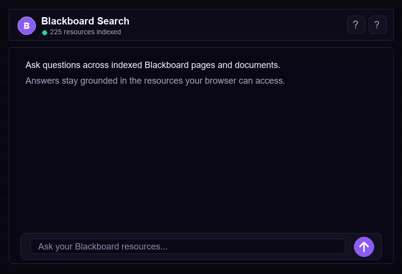

# Blackboard Search Extension

Blackboard Search Extension is a Chrome side-panel extension for searching Blackboard course materials and asking grounded questions about them. It indexes the Blackboard pages and files a signed-in user can already access, stores that searchable index locally in Chrome, and answers questions from the best-matching sources using a user-configured API provider.

The project is intentionally built as a local-first browser extension: there is no shared application server, no central Blackboard corpus, and no attempt to bypass institutional access controls.

## Demo



The demo shows the core flow: index Blackboard content, ask a question, get an answer grounded in matched resources, expand the source list, and open the original Blackboard page or file.

## What It Does

- Indexes Blackboard pages available to the user's active logged-in browser session.
- Indexes course pages, announcements, links, PDFs, and readable Office-style documents.
- Stores the searchable resource index and extracted text in `chrome.storage.local`.
- Supports maintainer-registered community resource packs that can be indexed locally after an active Blackboard session is confirmed.
- Ranks local matches before sending anything to an API provider.
- Sends the user's question and a bounded candidate-evidence set when API answering is enabled; the provider selects the strongest evidence and may request a bounded read of at most one nominated parent document.
- Supports OpenAI, DeepSeek, and OpenRouter with a user-provided API key.
- Shows expandable source cards so answers can be checked against the original material.
- Provides chat commands for reindexing, feedback, and retrieval diagnostics.

## What It Does Not Do

- It does not bypass Blackboard login, roles, permissions, or file access rules.
- It does not send the full local Blackboard index to the API provider or upload it to a shared server.
- It does not include embedded API keys, GitHub tokens, or private write credentials.
- It does not claim affiliation with Blackboard, Anthology, or any institution.
- The `main` branch is focused on text and document search. Experimental video/transcript work should stay isolated until it does not degrade the core search experience.

## Tech Stack

- **Chrome Extension Manifest V3** for packaging, permissions, background service worker, content scripts, action icon, and side panel.
- **Chrome Side Panel API** for the chat and setup UI.
- **Vanilla JavaScript, HTML, and CSS** for the extension interface. There is no frontend build step.
- **Chrome storage APIs** for local settings, API-key presence state, resource metadata, extracted content, and indexing state.
- **Content scripts** for reading Blackboard pages from the user's authenticated browser context.
- **Background service worker** for indexing, document fetching, extraction coordination, and storage updates.
- **PDF.js** for browser-side PDF text extraction.
- **Local retrieval logic** in `lib/search-index.js` for normalization, fused query routing, chunk ranking, source deduplication, and candidate pooling.
- **RAG orchestration** in `sidepanel/sidepanel.js` for query planning, semantic evidence selection, bounded nominated-document reading, cited synthesis, validation, and repair.
- **Provider client logic** in `lib/llm-client.js` for OpenAI-compatible chat completion calls.
- **Node.js scripts** for syntax checks, regression tests, prepublish checks, and store asset generation.
- **Python + Pillow** for generated Chrome Web Store artwork.

## How It Works

1. The user logs in to Blackboard normally in Chrome.
2. Before indexing or optional pack installation, the extension verifies that Blackboard session with a credentialed request.
3. The extension indexes configured Blackboard domains using the user's existing browser session.
4. Resource metadata is stored in `resource_index`.
5. Extracted searchable text is stored in `content_store`.
6. A user question is normalized and searched through fused local retrieval routes.
7. A bounded candidate-evidence set is sent to the selected API provider for semantic evidence selection. If the evidence is incomplete or requires careful policy interpretation, the provider may nominate at most one parent document for a bounded additional read.
8. Evidence from at most five parent documents is sent for synthesized answer generation, citation validation, and bounded repair when needed.
9. The side panel renders the final cited answer and one expandable source card per parent document.

The result is a retrieval-augmented workflow that keeps Blackboard discovery local while still letting the user ask natural-language questions.

## Privacy Model

The extension is designed around local control.

- The index, extracted text, settings, and API-key configuration are stored locally in Chrome.
- Community resource packs are installed only after an active Blackboard session check and are stored locally in the same Chrome storage index.
- The user supplies their own API provider and key.
- When answering is enabled, the extension sends the question and bounded subsets of candidate or selected evidence to the configured provider; one question may use multiple calls for planning, selection, generation, and validation or repair.
- The full local index is not sent to the provider or uploaded to a shared backend.
- Blackboard access remains governed by the user's existing Blackboard session and permissions.

For the user-facing policy, see [PRIVACY.md](PRIVACY.md).

## Install Locally

1. Download or clone this repository.
2. Open `chrome://extensions` in Chrome.
3. Enable **Developer mode**.
4. Click **Load unpacked**.
5. Select the repository folder.
6. Open Blackboard and sign in normally.
7. Open the Blackboard Search side panel.
8. Run `/index` to build the local resource index.
9. Open **Setup** and configure the API provider, model, and API key.
10. Ask questions about indexed Blackboard materials.

After pulling updates, reload the unpacked extension from `chrome://extensions` before testing again.

## Chat Commands

```text
/index
```

Builds or refreshes the local Blackboard index. Use this after first install, after course content changes, or when a source seems missing.

```text
/feedback [optional note]
```

Opens the configured feedback form, if feedback collection is enabled. If the user includes a note, the extension can prefill the first feedback field.

```text
/audit [question]
```

Runs a local retrieval diagnostic for a question. It reports index health, top raw matches, answer sources, hydration candidates, duplicate clusters, and signs that strong evidence exists but the answer layer missed it.


## Optional Resource Packs

Optional resource packs are JSON manifests that list prepared resources outside Blackboard. The extension can register community-collated class resource packs, such as the draft pack at `resource-packs/schwarzman-c11/pack.json`.

A pack can point to bundled files, such as PDFs committed with the extension, or to configured hosted files that Chrome is allowed to fetch. The installer first confirms an active Blackboard session and does not fetch the manifest or files while logged out. When a listed PDF or Office file is installed, the side panel extracts text with the existing browser-side document parser and saves only searchable text plus source metadata into local Chrome storage.

Recommended authoring flow:

1. Keep source PDFs and generated text in a private authoring repo if needed.
2. Publish or copy only the distributable pack files into `resource-packs/<pack-id>/`.
3. Add each file to the pack manifest.
4. Reload the unpacked extension and run the maintainer-provided hidden pack trigger once during testing.
5. Ask questions and verify the optional pack appears in source cards.

Do not embed GitHub tokens, private repository credentials, or API keys in a pack manifest. For details, see [docs/resource-packs.md](docs/resource-packs.md).

## Configuration Notes

### API Providers

The default provider is OpenRouter, but the extension also supports OpenAI and DeepSeek.

Recommended model examples:

```text
openrouter/auto
openai/gpt-4.1-mini
deepseek-chat
```

The API key is entered in the extension setup screen and stored locally by Chrome. Do not commit provider API keys or private credentials to this repository.

### Feedback Form

Feedback collection is optional. Configure `FEEDBACK_FORM_URL` and `FEEDBACK_FORM_FIELD_MAP` in `sidepanel/sidepanel.js` if you want `/feedback` to open a form.

Recommended visible questions:

```text
Suggestions for the bot
```

```text
Any other issues you're experiencing that software could help with?
```

Use only public form URLs or safe field identifiers. Never embed private write tokens, service-account credentials, GitHub tokens, or provider API keys in the extension.

### Host Permissions

The manifest controls which Blackboard or institution domains the extension can access. Before publishing or forking publicly, review `host_permissions` in [manifest.json](manifest.json) and keep them limited to the domains the extension actually needs.

## Repository Structure

```text
assets/icons/                 Extension icons
background/service-worker.js  Indexing, storage, document handling, and background messages
content/scraper.js            Blackboard page extraction content script
docs/demo/                    Demo media
docs/store/                   Chrome Web Store image assets
docs/testing.md               Manual and automated release checklist
lib/answer-formatting.js      Answer cleanup and citation formatting
lib/llm-client.js             API provider request client
lib/search-index.js           Local ranking, retrieval, dedupe, and snippet logic
sample-data/                  Example-only data for development and regression tests
scripts/                      Store asset generation and publish checks
sidepanel/                    Side-panel UI, setup flow, commands, and answer rendering
manifest.json                 Chrome extension manifest
PRIVACY.md                    User-facing privacy policy
```

## Development

There is no runtime bundling or compilation step. Edit the files directly, then reload the unpacked extension from `chrome://extensions`. A separate release script builds and verifies the exact Chrome Web Store artifact.

Useful checks:

```powershell
node --check background\service-worker.js
node --check content\scraper.js
node --check sidepanel\sidepanel.js
node scripts\regression-check.mjs
node scripts\prepublish-check.mjs
```

`node scripts\prepublish-check.mjs` is the main code gate. It checks session gating, bounded provider retries and truncation handling, generalized retrieval and reindex guards, semantic evidence selection and deep-read behavior, strict answer grounding and independently verified repair, randomized holdout accuracy, parent-document deduplication, performance budgets, transcript privacy/provenance, and the core regression suite.

To run that gate and then build the verified upload ZIP plus its matching unpacked directory:

```powershell
powershell.exe -NoProfile -ExecutionPolicy Bypass -File scripts\build-release.ps1
```

The builder packages only the extension runtime, icons, public documentation, and bundled resource packs. It rejects evaluation keys, fixtures, scripts, sample data, secret-like material, missing manifest references, and any ZIP whose entries differ from the verified unpacked directory.

## Testing Before Release

Before packaging for the Chrome Web Store:

- Reload the unpacked extension and test a clean install.
- Confirm `/index` is blocked while logged out, then run it after signing in to Blackboard.
- Ask representative course, deadline, document, and policy questions.
- Confirm answers are grounded in indexed material.
- Expand source cards and verify that `Open source` opens the expected page or file.
- Confirm source numbering is compact and does not skip numbers.
- Confirm multiple matching chunks from one document render as one source card without losing answer evidence.
- Run `/reindex` once when the extension reports a legacy truncated index; confirm it refreshes Blackboard content without deleting installed resource packs or API settings.
- Test the hidden pack trigger both logged out and logged in without exposing it in visible help text.
- Confirm the answer body does not expose raw Blackboard URLs or duplicate source blocks.
- Build with `scripts\build-release.ps1`, reload the generated `dist\BlackboardSearchExtension-<version>-unpacked` directory, and upload only the matching ZIP after the final smoke test.

See [docs/testing.md](docs/testing.md) for the full smoke-test and release checklist.

## Public Repository Safety

This README is written for a public repository. Before publishing a fork or release, also verify:

- No real API keys, service tokens, private write credentials, or personal access tokens are committed.
- Any feedback form URL is intended to be public.
- Manifest host permissions are scoped to the intended Blackboard domains.
- Sample data is synthetic, anonymized, or safe to share.
- Store screenshots do not reveal private student data, course rosters, grades, or institution-only materials.

## Branch Strategy

- `main`: production-oriented text and document search for Chrome Web Store packaging.
- Feature branches: isolate experimental indexing, transcript, or retrieval behavior until regression checks and manual QA show no degradation to the core text/PDF workflow.

## License

Add a license before distributing this repository publicly if one has not already been selected.
